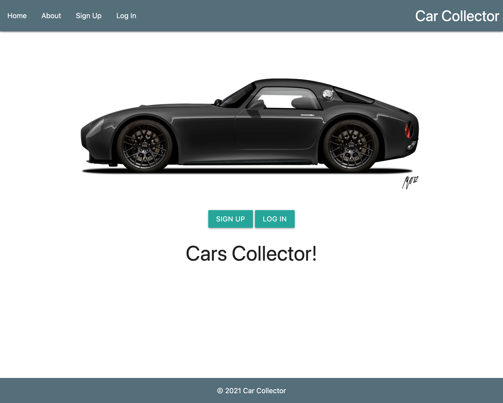
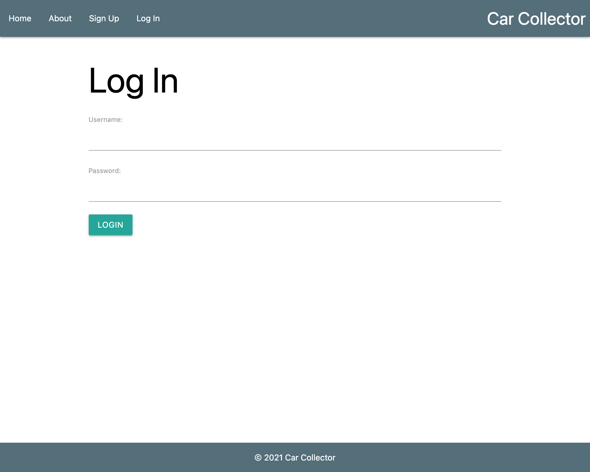
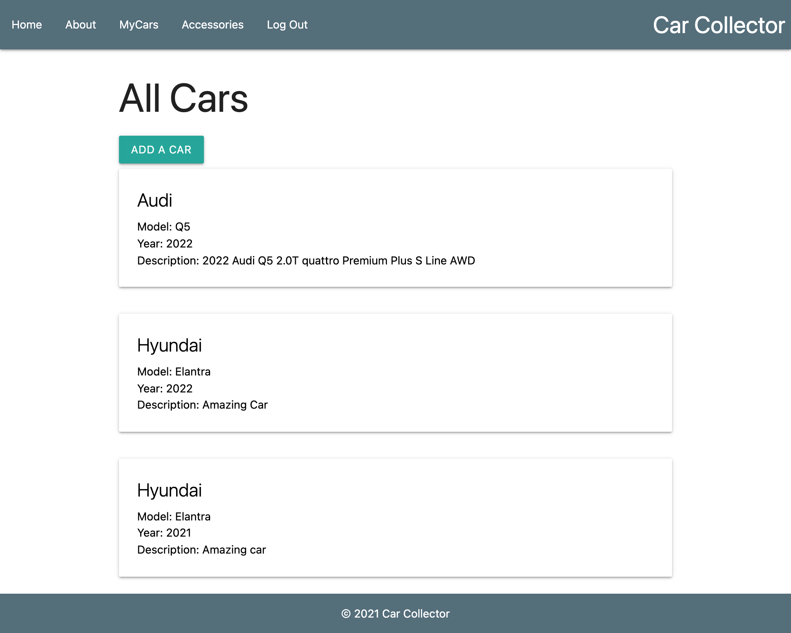
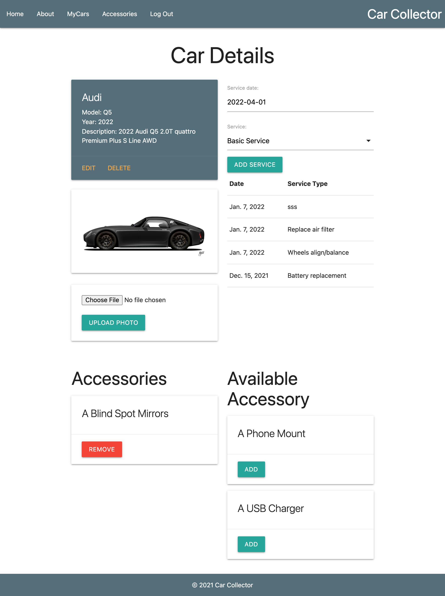
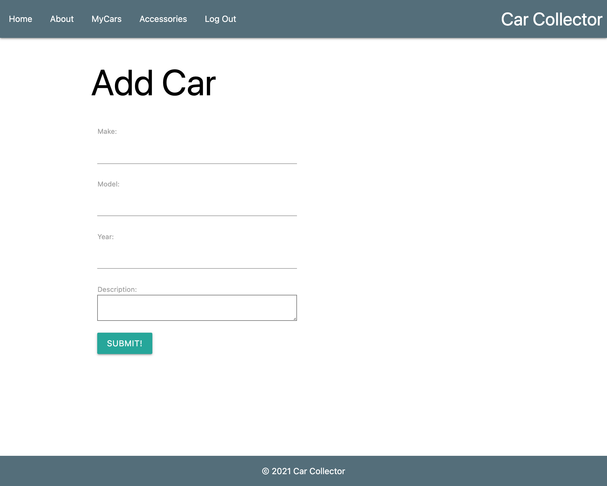

# Cars Collector Full Stack Web App - Django

Cars Collector is a full stack python - Django app where users manage their cars collection, service/repair date and type, and their car gadgets.

---

## Technologies Used

- HTML
- CSS
- Materialize
- JavaScript
- Python
- Django
- Postgresql
- AWS S3 Buckets

---

## Added Features

### Registration / Login

Users have to be registerd and login to get access and manage their cars repair date.

### Add Car and Accessories

Users can upload cars and Accossories.

- Make
- Model
- Year
- Description
- Image

### Manage Car repair and Services

Users can add service/repair type and date to manage their cars.

- Serice type
- Service Date

### Edite and Delete Cars and accossories

Users can Edit and delete their cars and accossories

---

## Screenshot

- [Home Page](#home-page)
- [Login Page](#login-page)
- [All Cars Page](#all-cars-page)
- [Car Details Page](#car-details-page)
- [Add Car Page](#add-car-page)
- [Accessory Page](#accessory-page)
- [Add Accessory Page](#add-accessory-page)

### Home Page

### Login Page

### All Cars Page

### Car Details Page

### Add Car Page

### Accessory Page

### Add Accessory Page

